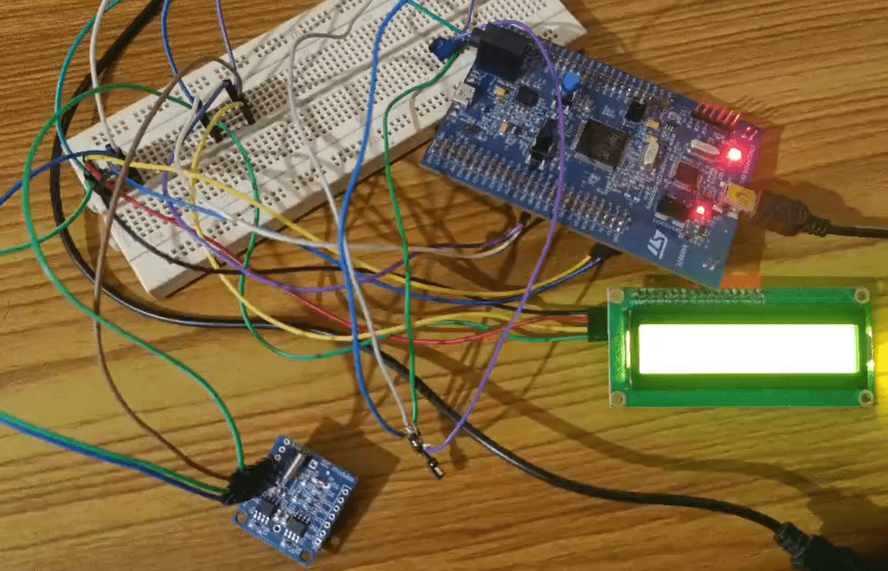

# Interfacing AHT25 Temperature and Humidity Sensor, DS1307 I2C RTC and 16*2 I2C LCD with STM32F407 Discovery Board

## Overview
This project demonstrates how to interface the AHT25 temperature and humidity sensor with the STM32F407 Discovery board. The sensor's data is displayed on a 16x2 I2C LCD, while the current time and date are fetched from a DS1307 RTC module.

## Project Demonstration

## Hardware Requirements
- STM32F407 Discovery board
- AHT25 temperature and humidity sensor
- 16x2 I2C LCD
- DS1307 RTC module
- Breadboard and jumper wires

## Software Requirements
- STM32CubeIDE
